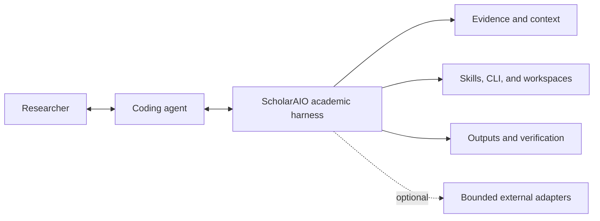

<div align="center">

<!-- TODO: Replace with actual logo when available -->
<!--  -->

# ScholarAIO

**Scholar All-In-One — an academic harness for AI agents.**

[English](README.md) | [中文](README_CN.md)

[](https://github.com/ZimoLiao/scholaraio/stargazers)
[](LICENSE)
[](https://www.python.org/)
[](.agents/skills/)

</div>

---

Your coding agent already reasons, plans, browses, writes code, and uses tools. ScholarAIO adds the academic harness around it, so the same agent can carry evidence, project state, repeatable workflows, and reviewable outputs across the whole research process.

- Your paper library becomes a reusable knowledge base for the same agent.
- Skills and CLI contracts give the agent stable ways to search, read, organize, cite, write, and verify.
- Optional tools are integrated selectively when they strengthen that workflow and degrade cleanly when unavailable.

Here, **All-in-One means one coherent academic workflow**, not every scientific package in one distribution. The active agent supplies reasoning and orchestration; ScholarAIO supplies the durable academic context and operational contracts around it.

<div align="center">
  
</div>

ScholarAIO offers more than search. It gives an AI coding agent a stable academic substrate for evidence, project memory, tool use, research outputs, and verification without trying to replace the agent itself.



## Quick Start

The default and recommended way to use ScholarAIO is simple: install it, configure it once, and open this repository directly with your coding agent.

```bash
git clone https://github.com/ZimoLiao/scholaraio.git
cd scholaraio
pip install -e .
scholaraio setup
```

Then open the repository in Codex, Claude Code, or another supported agent. In this setup, the agent gets the fullest experience: bundled instructions, local skills, the CLI, the repository knowledge map in [`docs/DESIGN.md`](docs/DESIGN.md), and the complete codebase context are all available directly. For Claude Code plugins, Codex/OpenClaw skill registration, and other setup paths, see [`docs/getting-started/agent-setup.md`](docs/getting-started/agent-setup.md).

## Upgrading To 2.0

ScholarAIO 2.0 is a product-boundary and compatibility release; it does not
change the current data layout for 1.4 or 1.5 users. Upgrade the package, run
`scholaraio setup check`, and rebuild indexes when appropriate. Users coming
from 1.3 or earlier must still complete the explicit runtime migration.

See [`docs/getting-started/upgrading-to-2.0.md`](docs/getting-started/upgrading-to-2.0.md)
for removed surfaces, migration guidance, and the 2.x compatibility promise.

## What It Does

|  | Feature | Details |
|--|---------|---------|
| **PDF Parsing** | Deep structure extraction | Convert PDFs into structured Markdown while preserving formulas, figures, and layout as much as possible |
| **Not Just Papers** | More than papers | Journal articles, theses, patents, technical reports, standards, and lecture notes — four inbox categories with tailored metadata handling |
| **Hybrid Search** | Keyword + semantic fusion | Combine full-text and vector retrieval, with optional line-addressable evidence chunk search for precise source snippets |
| **Topic Discovery** | See what your library is about | Automatically group papers into research themes and use interactive views to grasp the overall structure quickly |
| **Literature Exploration** | Multi-dimensional discovery | Explore a research direction through journal, topic, author, institution, keyword, year, citation impact, and more |
| **Citation Graph** | References & impact | Forward citations, backward citations, and shared-reference analysis |
| **Layered Reading** | Read on demand | Start with metadata or the abstract, then move into conclusions or full text only when you need to |
| **Local Library WebUI** | Search, cite, and read | Filter records by field, run keyword/semantic/unified retrieval, copy canonical BibTeX, inspect audit status and Markdown summaries, and open PDFs inline or in the OS default viewer; WSL launches a stable Windows edit mirror and automatically persists embedded annotations back to the canonical library PDF |
| **Publisher PDF Fetch** | Use your current access | Fetch DOI or publisher-page PDFs through the user's legal network context, with direct campus-network mode and selected/all-library PDF refetch |
| **Multi-Source Import** | Connect your existing library | Import directly from reference managers, fetched PDFs, local PDFs, and Markdown without rebuilding your library from scratch |
| **Workspaces** | Organize by project | Manage paper subsets with scoped search and BibTeX export |
| **Multi-Format Export** | BibTeX, RIS, Markdown, DOCX | Export your full library or a workspace for Zotero, Endnote, submission, or sharing |
| **Metadata Scrub** | Incremental cleanup after enrich | Review and repair low-quality titles, authors, and years for non-standard documents, then mark reviewed records to skip future passes |
| **Persistent Notes** | Cross-session memory | Keep analysis notes for each paper so future sessions can reuse them instead of starting over |
| **Research Insights** | Reading behavior analytics | Search hot keywords, most-read papers, reading trends, and semantic neighbor recommendations for papers you haven't read yet |
| **Federated Discovery** | Cross-library search | Search your main library, exploration libraries, and arXiv from one entry point instead of hopping across tools |
| **Remote Backup** | Rsync-based sync | Back up the ScholarAIO `data/` workspace to configured remote targets through named rsync plans |
| **Grounded Scientific Tool Use** | Consult exact interfaces | Use versioned official documentation at runtime instead of guessing scientific-software commands and parameters |
| **Bounded Tool Adapters** | Integrate only when justified | Keep external tools optional, isolated, testable, and subject to the 2.x integration gate |
| **Academic Writing** | AI-assisted writing | Router-first workflows for literature review, guided single-paper reading, paper sections, citation check, rebuttal, gap analysis, poster packages, and technical reports — with every citation traceable to your own library |

For writing tasks, start with the router-style writing entry when the deliverable is clear but the workflow is not. The current writing stack is organized around:

- `academic-writing`: route by deliverable and writing stage
- `nature-workflow`: bridge to the upstream `nature-skills` bundle for Nature/high-impact figures, polishing, writing, reviewer critique, citation, Data Availability, paper reading, reviewer response, paper-to-PPT, and academic search; direct upstream skills are preferred when available
- `literature-review`: long-form review and survey writing
- `paper-guided-reading`: guided deep reading of a single paper from fuzzy search to full-text analysis
- `paper-writing`: manuscript sections and paper-focused drafting
- `review-response`: rebuttal and response-letter workflows
- `research-gap`: gap analysis and open-question reports
- `technical-report`: technical briefings and topic reports
- `poster`: poster-oriented content packaging
- `document`: final DOCX / PPTX packaging

See [`docs/guide/writing.md`](docs/guide/writing.md) for the full writing map.

## Works With Your Agent

ScholarAIO is designed to be **agent-agnostic**, but different agents expose different integration paths. Some work best when you open this repository directly; others are easier to use through plugins.

| Agent / IDE | Open this repo directly | Reuse from another project |
|-------------|-------------------------|-----------------------------|
| [Claude Code](https://docs.anthropic.com/en/docs/claude-code) | `CLAUDE.md` + `.claude/skills/` | Claude plugin marketplace |
| [Codex](https://openai.com/codex) / OpenClaw | `AGENTS.md` + `.agents/skills/` | `scholaraio setup agent` |
| [Cline](https://github.com/cline/cline) | `.clinerules` + `.claude/skills/` | `scholaraio setup agent --target-project ...` |
| [Qwen](https://qwen.ai/) | `.qwen/QWEN.md` + `.qwen/skills/` | `scholaraio setup agent --target-project ...` |
| [Cursor](https://cursor.sh) | `.cursor/rules/scholaraio.mdc` + `AGENTS.md` (`.cursorrules` legacy fallback) | `scholaraio setup agent --target-project ...` |
| [Windsurf](https://codeium.com/windsurf) | `.windsurfrules` | `scholaraio setup agent --target-project ...` |
| [GitHub Copilot](https://github.com/features/copilot) | `.github/copilot-instructions.md` | `scholaraio setup agent --target-project ...` |

Skills follow the open [AgentSkills.io](https://agentskills.io) standard, and `.agents/skills/` and `.qwen/skills/` are symlinks to `.claude/skills/` so different agents can discover and reuse the same skills. Qwen-specific project context lives in `.qwen/QWEN.md`.

For reuse from another project, run `scholaraio setup agent` to preview shell, skill-discovery, and project-wrapper changes; add `--apply` to perform the automatic steps.

Wrappers created with `--target-project` include local machine paths; review the managed block before committing those files to a shared repository.

**Migrating from existing tools?** Import directly from Endnote (XML/RIS) and Zotero (Web API or local SQLite), with PDFs, metadata, and references brought over together. If your current network has publisher access, `scholaraio fetch-pdf` can also pull DOI or landing-page PDFs into the normal ingest flow or refresh canonical PDFs for existing library records.

## Configuration

> Start by opening `scholaraio` with your agent and let it walk you through the setup. The notes below are only a basic overview.

ScholarAIO starts with a minimal setup. Install optional capabilities only when a workflow needs them.

- `scholaraio setup` walks you through the basics.
- `scholaraio setup agent` configures cross-project agent discovery and CLI runtime wiring.
- An LLM API key is optional but recommended for more robust metadata extraction and content completion.
- A MinerU token is optional but recommended, and free. You can also deploy MinerU or Docling locally for PDF parsing.
- `scholaraio setup check` shows what is installed, what is optional, and what is missing.

Full setup and configuration details → [`docs/getting-started/agent-setup.md`](docs/getting-started/agent-setup.md), [`config.yaml`](config.yaml)

## Agent First, CLI Available

ScholarAIO works best through an AI coding agent, but it also provides a CLI for scripting, debugging, and quick queries. For a current command reference aligned with the code, see [`docs/guide/cli-reference.md`](docs/guide/cli-reference.md).

## Project Structure

```
scholaraio/             # Python package — CLI and all core modules
  ingest/               #   PDF parsing + metadata extraction pipeline
  sources/              #   External source adapters (arXiv / Endnote / Zotero)

.claude/skills/         # Agent skills (canonical source)
.agents/skills/         # ↑ symlink for cross-agent discovery
.qwen/QWEN.md           # ↑ project context for Qwen Code
.qwen/skills/           # ↑ symlink for Qwen agent skill discovery
data/libraries/papers/  # Paper library (fresh default)
data/libraries/proceedings/ # Proceedings library (fresh default)
data/spool/inbox/       # Drop PDFs here for ingestion
data/spool/inbox-proceedings/ # Dedicated proceedings ingest inbox
```

Upgrading from an older release? See [Upgrading To 2.0](#upgrading-to-20).

- Agent entry docs: [`CLAUDE.md`](CLAUDE.md) or [`AGENTS.md`](AGENTS.md)
- Repository knowledge map: [`docs/DESIGN.md`](docs/DESIGN.md)
- Deep agent reference: [`docs/guide/agent-reference.md`](docs/guide/agent-reference.md)

## Citation

If you use ScholarAIO in your research, please cite:

```bibtex
@software{scholaraio,
  author = {Liao, Zi-Mo},
  title = {ScholarAIO: An Academic Harness for AI Agents},
  year = {2026},
  url = {https://github.com/ZimoLiao/scholaraio},
  license = {MIT}
}
```

## License

[MIT](LICENSE) © 2026 Zi-Mo Liao
